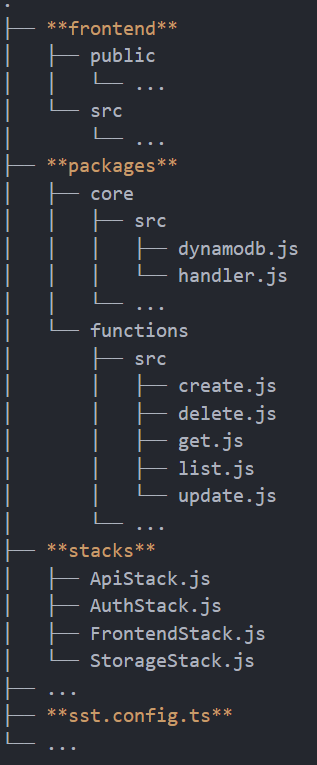

#### Serverless Stack (SST)

Serverless Stack (SST) on framework serverless-sovellusten rakentamiseen. Siinä pystytetään AWS:n infrastruktuuri käyttäen Cloud Development Kit (AWS CDK) -teknologiaa, jossa pystytettävät resurssit määritellään luokkina (tässä projektissa JavaScript-luokkina). Deployatessa CDK kääntää koodin CloudFormation templaatiksi.

Projektin rakenne on seuraava:
.
├── **frontend**
│   ├── public
│   │   └── ...
│   └── src
│       └── ...
├── **packages**
│   ├── core
│   │   ├── src
│   │   │   ├── dynamodb.js
│   │   │   └── handler.js
│   │   └── ...
│   └── functions
│       ├── src
│       │   ├── create.js
│       │   ├── delete.js
│       │   ├── get.js
│       │   ├── list.js
│       │   └── update.js
│       └── ...
├── **stacks**
│   ├── ApiStack.js
│   ├── AuthStack.js
│   ├── FrontendStack.js
│   └── StorageStack.js
├── ...
├── **sst.config.ts**
└── ...

- frontend-kansio sisältää React-sovelluksen
- packages-kansio sisältää kaksi kansiota:
	- core -> ns. aputiedostoja
	- functions -> lambda-funktiot
- stacks-kansio sisältää infran pystyttämiseen käytetyt CloudFromation-stackit
- sst.config.ts-tiedosto hallinnoi koko sovellusta