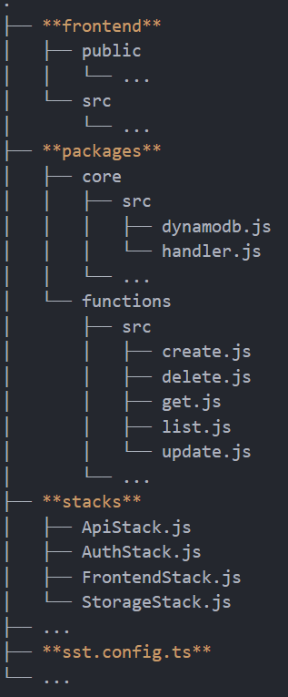
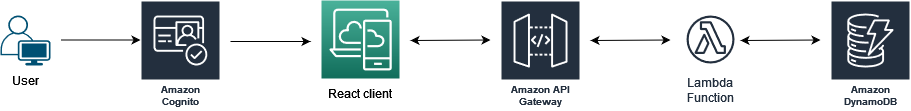

## Serverless Stack (SST)

Serverless Stack (SST) on framework full-stack-serverless-sovellusten rakentamiseen. Siinä pystytetään AWS:n infrastruktuuri käyttäen Cloud Development Kit (AWS CDK) -teknologiaa, jossa pystytettävät resurssit määritellään nykyaikaisilla ohjelmointikielillä (JS/TS, Python, Java, C#). Deployatessa CDK kääntää koodin CloudFormation templaatiksi.

## Projekti

Projekti toimi Backend 2 -kurssin lopputyönä. Työssä oli tarkoituksena tutustua SST-frameworkiin vastapainona kurssilla käytettyyn serverless-frameworkiin. Frontend on sovelluksessa vain CRUD-toimintojen demoamiseen. Projekti toteutettiin SST:n oman tutoriaalin pohjalta: https://sst.dev/guide.html

Sovelluksessa käyttäjä voi rekisteröitymisen ja sisäänkirjautumisen jälkeen lisätä suorittamiansa kursseja sekä muokata tai poistaa niitä.

**Sovelluksen päärakenne:**

- frontend-kansio sisältää React-sovelluksen
- packages-kansio sisältää kaksi kansiota:
  - core -> ns. aputiedostoja
  - functions -> lambda-funktiot
- stacks-kansio sisältää infran pystyttämiseen käytetyt tiedostot, joista ns. tulee CloudFormation-stackeja
- sst.config.ts-tiedosto hallinnoi koko sovellusta

**Sovelluksen arkkitehtuuri:**

1. Käyttäjä rekisteröityy ja kirjautuu sisään käyttäen Cognito-autentikointia
2. Frontend-sovelluksesta lähtevät pyynnöt välitetään API Gatewayn kautta pyyntöön täsmäävälle Lambda-funktiolle
3. Lambda-funktio välittää pyynnön DynamoDB:lle ja palauttaa vastauksen frontend-sovellukselle

#### Pystyttäminen (ei vielä testattu, että toimii näin)

_HUOM! Sovelluksen pystyttäminen vaatii AWS-tilin riittävillä IAM-käyttöoikeuksilla (ks. ohjeet: https://sst.dev/chapters/create-an-iam-user.html)._

> Tiedostossa `sst.config.ts` voit asettaa haluamasi nimen projektille sekä käytettävän regioonan

> Suorita `npm install` -komento sekä projektin juuressa että frontend-kansiossa

> Suorita `npx sst dev` -komento projektin juuressa (pystyttää sovelluksen pilveen)

> Suorita `npm start` -komento frontend-kansiossa (käynnistää React-clientin)
